**Project Title: ERP_System(link)**

**Description:**
The ERP System Frontend is a web application designed to manage basic business operations efficiently. It includes features such as product management, order management, and optional calendar view for orders. The frontend is built using React and utilizes React Router for navigation between different sections of the ERP system.

**Setup and Usage Instructions:**

1. **Clone the Repository:**
   ```
   git clone https://github.com/atulraj11/ERP_SYSTEM.git
   ```

2. **Navigate to the Project Directory:**
   ```
   cd ERP_SYSTEM
   ```

3. **Install Dependencies:**
   ```
   npm install
   ```

4. **Run the Application:**
   ```
   npm start
   ```

5. **Access the Application:**
   Open your web browser and go to [http://localhost:3000](http://localhost:3000) to access the ERP System Frontend.

**Interacting with the Website-** The website consists of three essential features, the Dashboard, that consists of icons to navigate to the other features namely Products Management and Orders Management


**Dashboard:** 
- Access the Dashboard page upon opening the application.
- View key metrics such as total number of products and orders, Sales Revenue, Average Order Value and Recent orders.
- Click on the provided icons to navigate to the Products and Orders management pages.

**Products Management:** 
- Click on the "Product icon" to access the Products Management page.
- View a list of products with details such as name, category, price, and stock quantity.
- Use the functionalities provided to add, edit, and delete products.

**Orders Management:** 
- Click on the "Order icon" to access the Orders Management page.
- View a list of orders with details such as order ID, order date, and status.
- Click on the "View more" button to view all the details regarding a specific order.
- Update the status of the order as needed.
- Utilize the option to delete orders as needed.

**Screenshots:**

- **Desktop View**

**Dashboard**
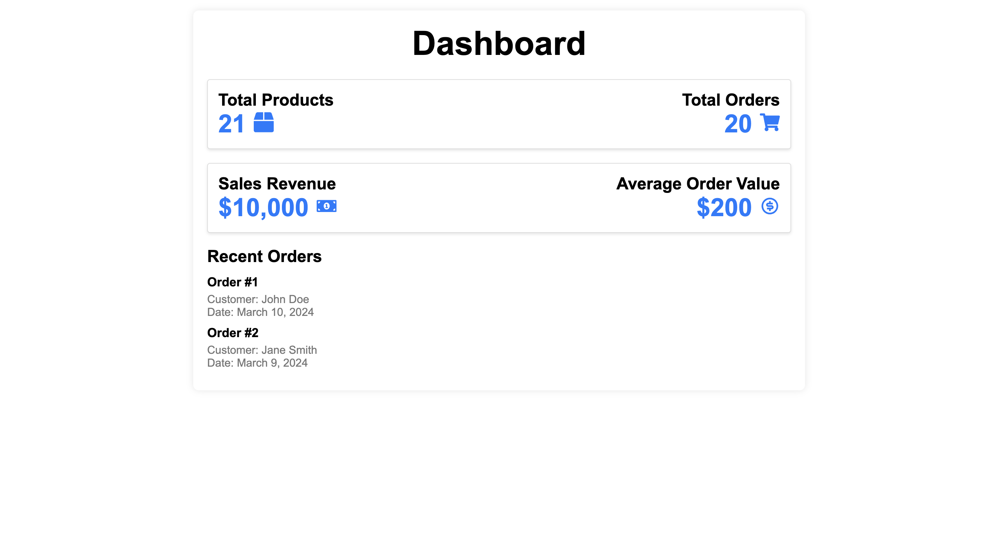

**Product Management (Pagination is also added)**
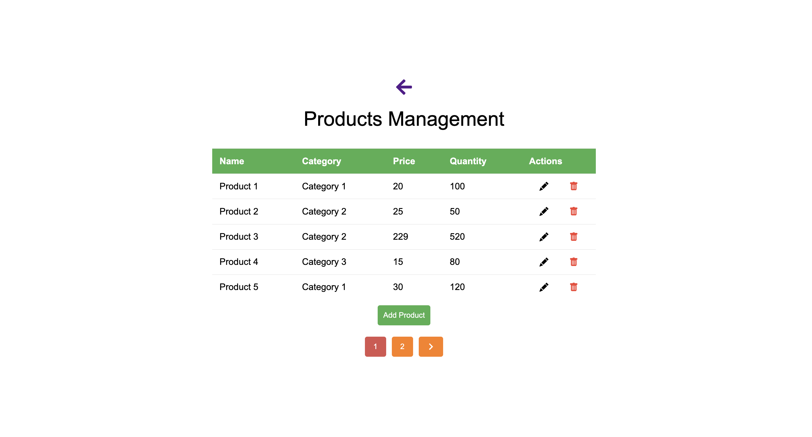

**Add Product Modal**
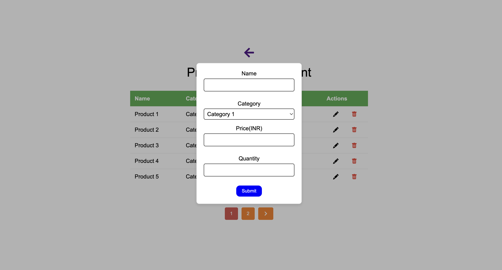

**Edit Product Modal**
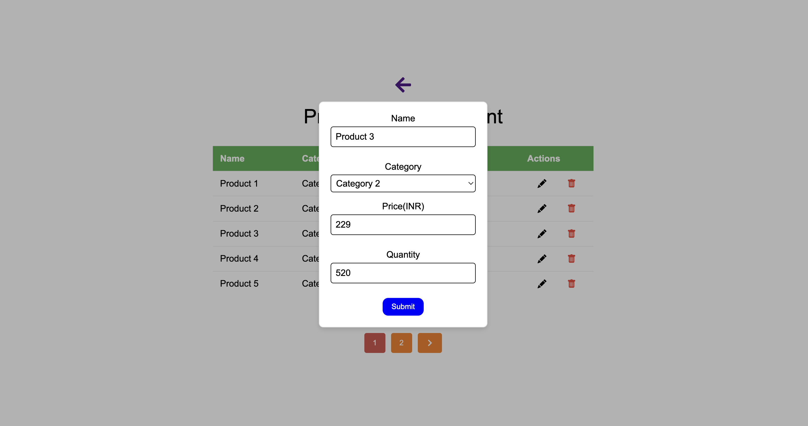

**Order Management (Pagination is also added)**
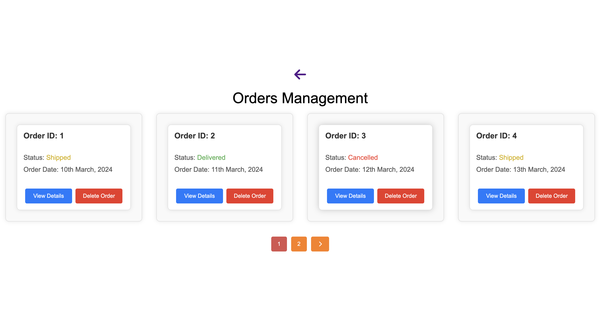

**View Order Details Modal**
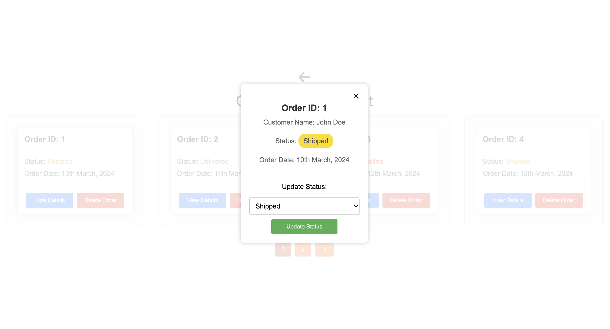

- **Mobile View**

**Dashboard**
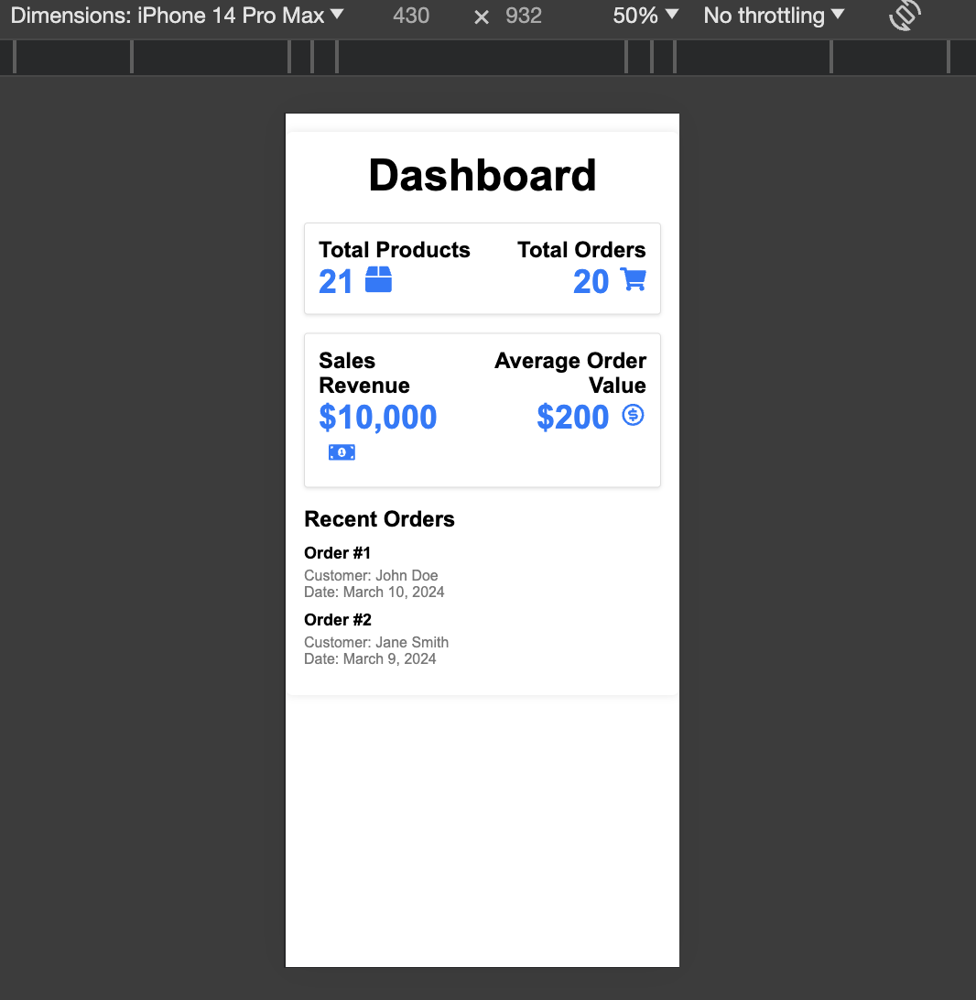

**Product Management (Pagination is also added)**
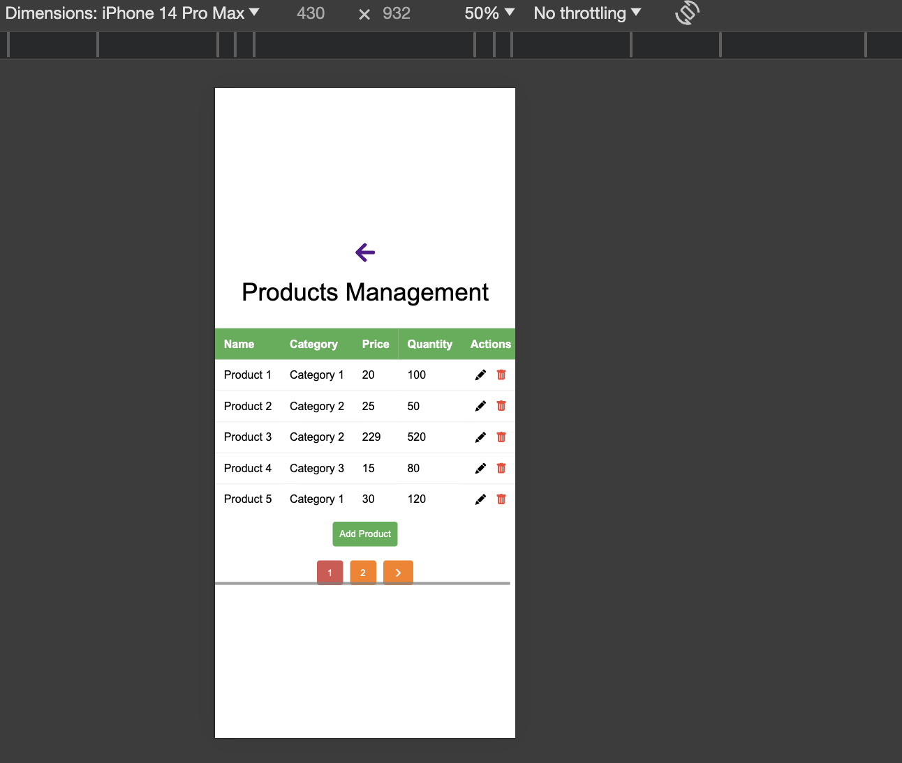

**Add Product Modal**
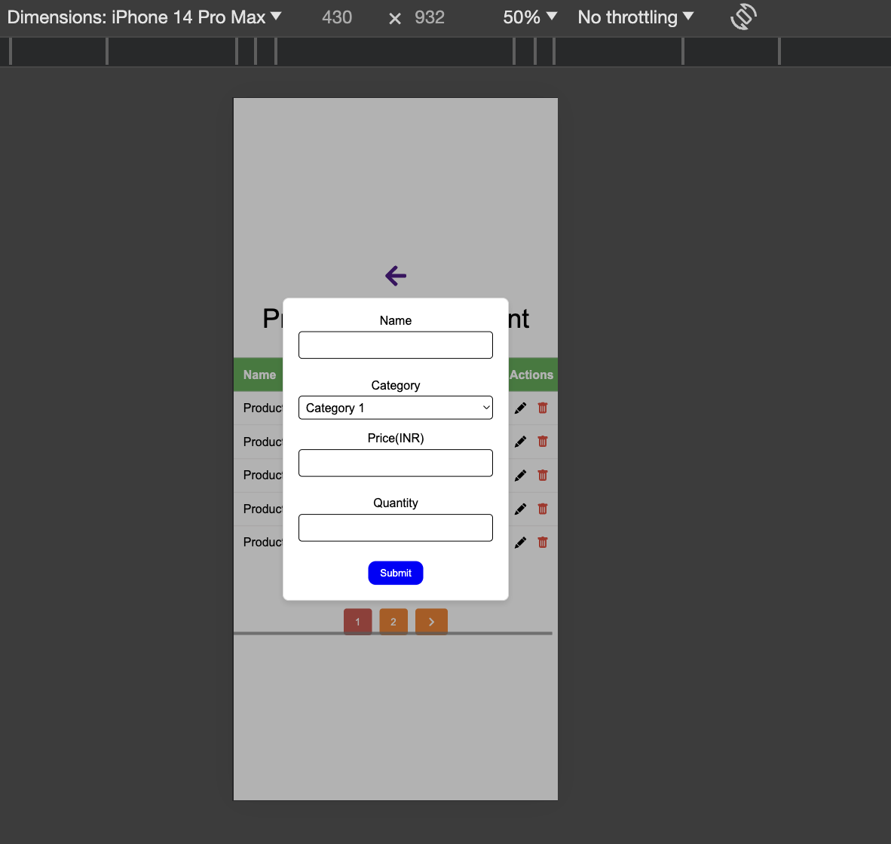

**Edit Product Modal**
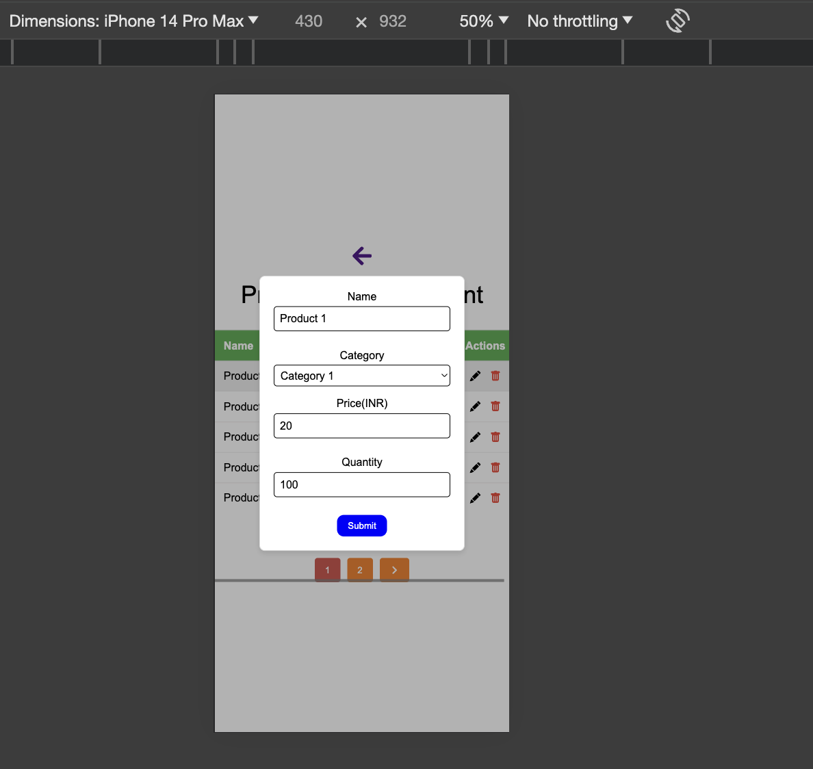

**Order Management (Pagination is also added)**
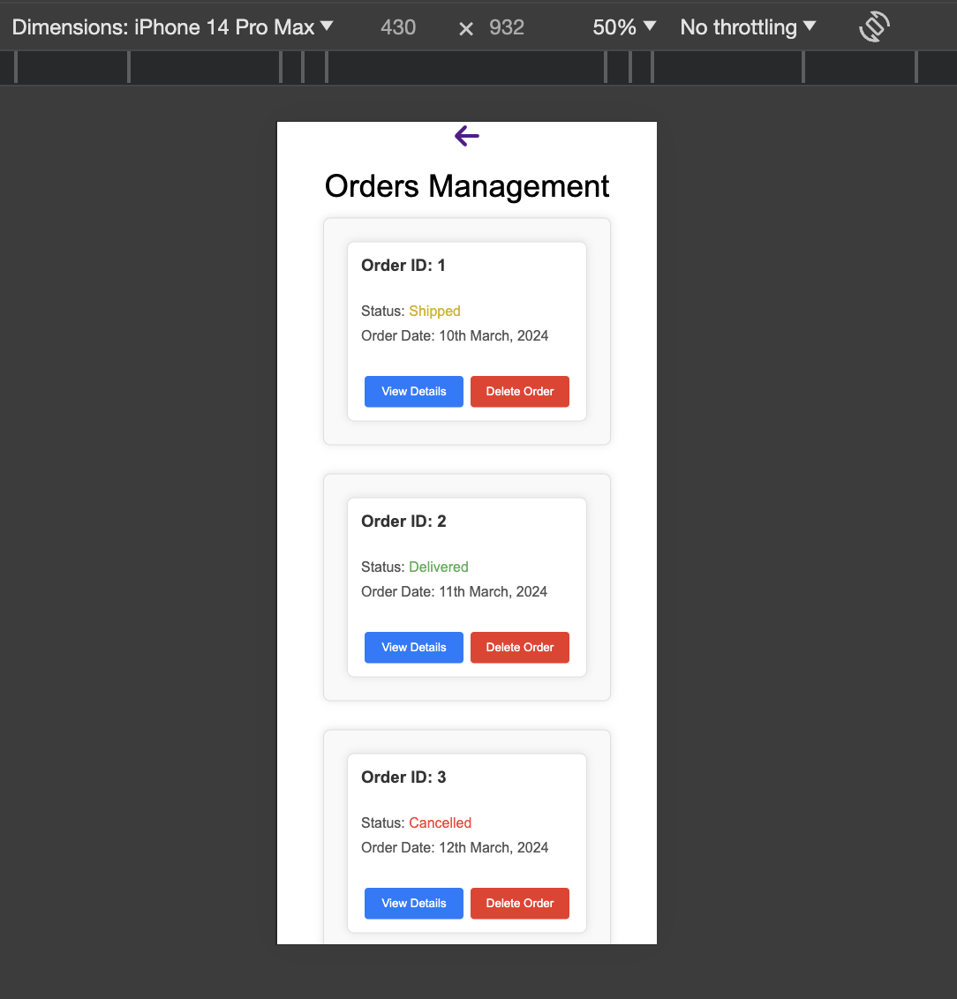

**View Order Details Modal**
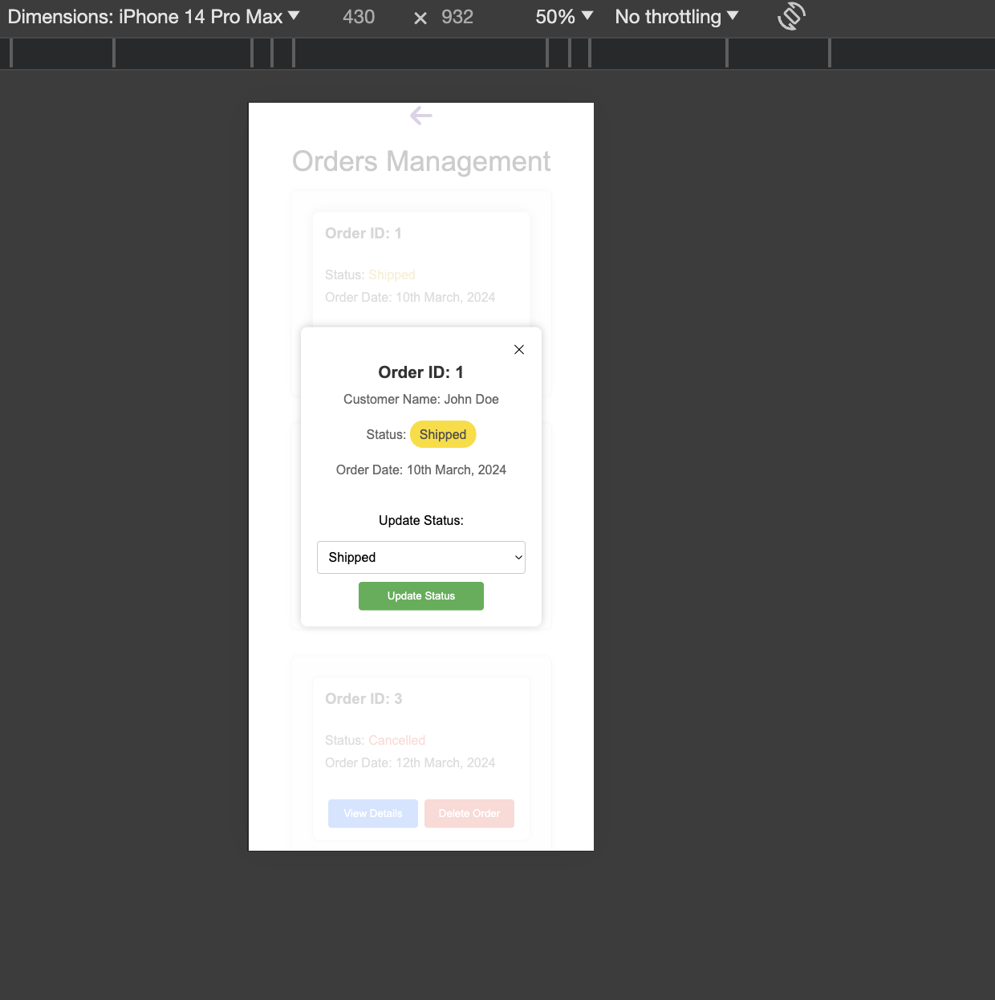


**Submission:**
The project has been hosted on GitHub. You can access the repository [here](https://github.com/atulraj11/ERP_SYSTEM).
